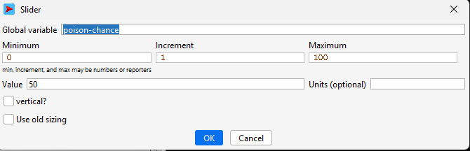
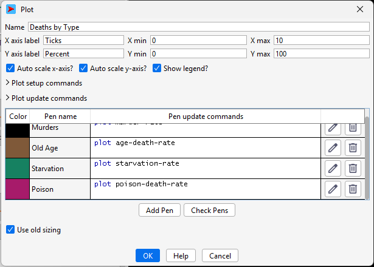

## Комп'ютерні системи імітаційного моделювання
## СПм-24-4, **Почуєнков Владислав Ігорович**
### Лабораторна робота №**2**. Редагування імітаційних моделей у середовищі NetLogo

 

### Варіант 13, модель у середовищі NetLogo:
[Fruit Wars](https://www.netlogoweb.org/launch#http://www.netlogoweb.org/assets/modelslib/Sample%20Models/Social%20Science/Economics/Fruit%20Wars.nlogo)

 

### Внесені зміни у вихідну логіку моделі, за варіантом:

**Додаємо в інтерфейс моделі новий повзунок poison-chance** який буде контролювати появу отруйних кущів.  

**Глобальні змінні (globals).** Додали лічильники для статистики смертей від отрути. (Примітка: poison-chance тут немає, бо він створений як повзунок в інтерфейсі): 
<pre>
globals [
  ; ... старі змінні ...
  poison-death-count ; Лічильник смертей від отрути
  poison-death-rate  ; Відсоток смертей від отрути
]
</pre>

**Властивості кущів (fruit-bushes-own).** Додали "прапорець", який визначає, чи кущ отруйний:
<pre>
 fruit-bushes-own [
  amount
  poisonous? ; true = отруйний, false = їстівний
]
</pre>

**Властивості збирачів (foragers-own).** Додали таймер хвороби та пам'ять про початкову швидкість:
<pre>
foragers-own [
  ; ... старі змінні ...
  poisoned-ticks-remaining ; Скільки тактів залишилося бути "хворим"
  original-speed           ; Щоб повернути швидкість після одужання
]
</pre>

**Генерація отрути.** Змінюємо процедуру створення кущів (to grow-fruit-bushes), щоб деякі з них ставали отруйними та змінювали колір фруктів на чорний:
<pre>
sprout-fruit-bushes 1 [
  set shape "Bush"
  
  ; --- Нова логіка ---
  if-else random 100 < poison-chance [ ; Використовуємо значення з повзунка
    set poisonous? true
    set color black ; Отруйний = чорний
  ] [
    set poisonous? false
    set color one-of [ red blue orange yellow ] ; Звичайний
  ]
  ; ...
]
</pre>

**Логіка руху та отруєння** Збирач повинен рухатися повільніше, якщо він отруєний. Вносимо зміни у процедуру to move-foragers:
1. Таймер отруєння: Кожен такт зменшуємо час дії отрути. Якщо час вийшов — повертаємо швидкість.
<pre>
if poisoned-ticks-remaining > 0 [
  set poisoned-ticks-remaining poisoned-ticks-remaining - 1
  if poisoned-ticks-remaining = 0 [
    set speed original-speed ; Одужання
  ]
]
</pre>
2. Візуалізація: Якщо збирач отруївся, він стає фіолетовим. (Додано на власний розсуд.)
<pre>
if-else poisoned-ticks-remaining > 0 [
  set color violet ; Пріоритетний колір хвороби
] [
  ; ... стандартна логіка кольорів (за силою/швидкістю) ...
]
</pre>

**Наслідки отруєння.** Це нова процедура(to apply-poison), яка визначає долю збирача після поїдання отруєнних фруктів:
<pre>
let survival-chance (strength / 60) ; Чим сильніший, тим більше шансів вижити

if random-float 1.0 > survival-chance [
  ; --- Смерть ---
  set poison-death-count poison-death-count + 1
  ; Створюємо ФІОЛЕТОВИЙ хрестик
  hatch-deaths 1 [set color violet set shape "x" set age 0]
  die
] [
  ; --- Виживання (Штраф) ---
  if poisoned-ticks-remaining = 0 [ ; Якщо ще не хворий
    set original-speed speed
    set speed (speed / 2) ; Уповільнення вдвічі
    set poisoned-ticks-remaining 50 ; На 50 тактів
  ]
]
</pre>
Залежно від параметру сили збирача він або помирає при поїданні отруйних фруктів, або виживає і його швидкість зменшується вдвічі. На власний розсуд було додано фіолетовий хрестик на карті коли збирач помирає від отрути.

**Додаємо на графік "Death by type" новий тип смертності "від отруєння"(poison)**:  

 

### Внесені зміни у вихідну логіку моделі, на власний розсуд:

**Змінюємо логіку моделі так, щоб отруйні кущі не давали енергії, але все одно зникали при поїданні.** Вносимо зміни у процедуру to forage:
<pre>
let bush-is-poison [poisonous?] of target-bush

; Кущ зменшується у будь-якому разі
ask target-bush [ set amount amount - 10 ]

; Енергію даємо ТІЛЬКИ якщо кущ НЕ отруйний
if not bush-is-poison [
  set energy energy + forage-rate
  set total-foraged total-foraged + forage-rate
]

; Перевірка на вичерпання куща
if [amount] of target-bush < 0 [
  ; Якщо кущ був отруйним -> застосувати отруту до всіх на цій клітині
  if bush-is-poison [
    ask foragers-at-this-bush [ apply-poison ]
  ]
  ask target-bush [ die ]
]
</pre>

Фінальний код моделі та її інтерфейс доступні за [посиланням](Fruit-Warsnew.nlogox). *// якщо вносили зміни до інтерфейсу середовища моделювання - то експорт потрібен у форматі nlogo, як тут. Інакше, якщо змінювався лише код логіки моделі, достатньо викласти лише його, як [тут](example-model-code.html),якщо експортовано з десктопної версії NetLogo, або окремим текстовим файлом, шляхом копіпасту з веб-версії*.
 

## Обчислювальні експерименти
*// тут повинен бути наведений опис одного експерименту, за аналогією з першої л/р.* 
### 1. Вплив дисциплінованості водіів на середню швидкість переміщення
